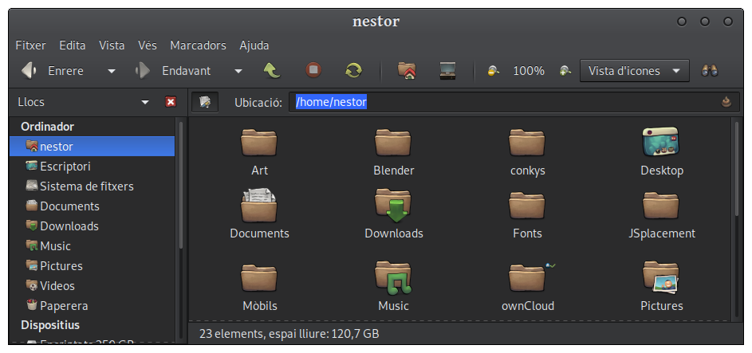
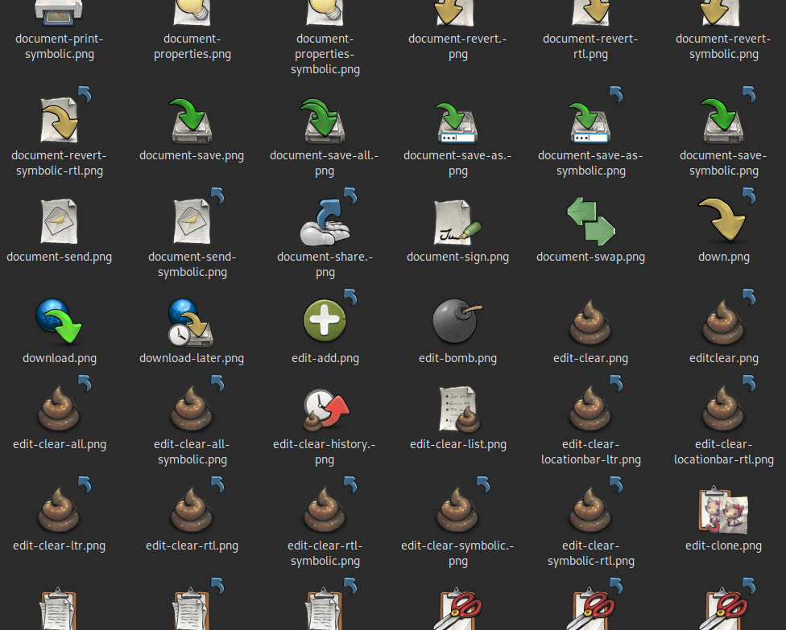
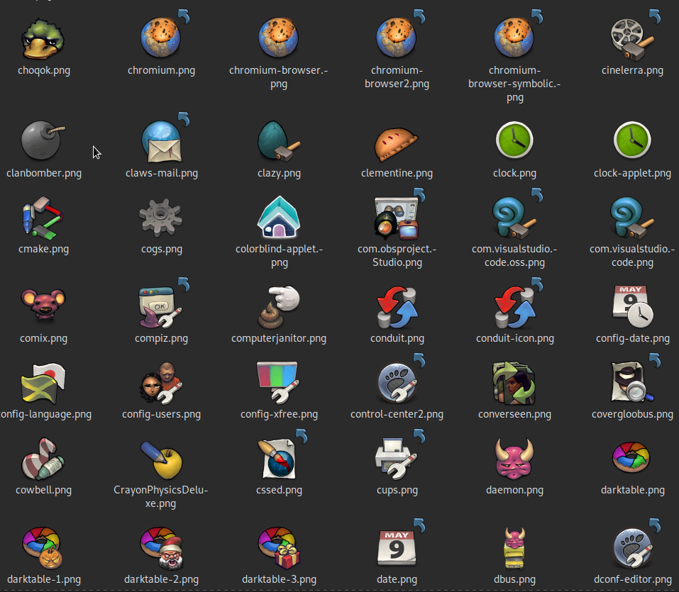
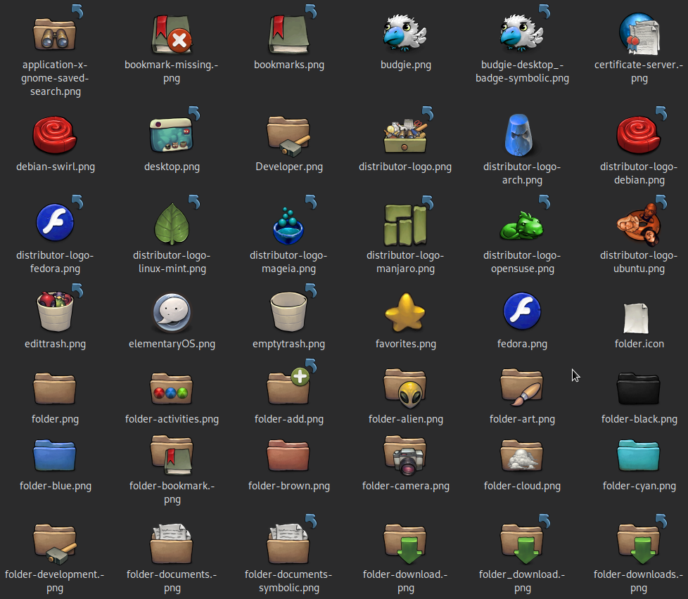

# Description

**Buuf For Many Desktops** icon set (formerly known as "Buuf Nestort", I've decided to remove my alias from the theme's na

This is a fairly complete set of icons for Gnome, KDE Plasma and XFCE (including actions, apps, categories, devices, emblems, emotes, mimetypes, places and status), based on the icons and artwork by Paul Davey (Mattahan) (http://www.mattahan.com/). Some of them come from OxayotlTheGreat and his great job with his own remix, Buuf https://www.gnome-look.org/p/1012512)

One of the main points of this theme is to remove as many symbolic icons as possible (that means linking the symbolic icon to the original icon). This is not always possible, especially for certain Gnome icons, because Gnome applies some effects to some icons, which make them look really bad if they are not real symbolic icons.

Preview:






# Installation

There are two options:

To make this theme available for every user (including root, useful when you run apps with root privileges such as packet manager), copy this directory to `/usr/share/icons` (you'll need super-user rights).

If you just need to make it available for your user, you may copy it to `~/.icons` (`~` stands for your home directory, in case you don't know the basics of GNU/Linux shell)

# Customization

This theme includes many distributor logos. By default, `places/distributor-logo.png` links to `start-here.png`, which also links to `start-here-agnostic.png`, which looks like a drawer with lots of stuff inside. You may change this symbolic link to whichever icon you fancy more, using these commands (supposing you are in the places directory):

```sh
rm start-here.png
ln -s <icon_you_d_like_as_start_button> start-here.png
```

you need to do it before installing the theme (or, if you have already installed it, then operate on the directory where you installed it, bearing in mind that if you installed it in `/usr/share/icons`, you need root privileges).

# Change log

## Version 2.0 2020-08-29

This is a massive update from the previous version, from 2011!
It is not yet complete, and it still has some svgs and pngs from other themes  as "placeholders" for pending icons, plus some other missing ones. I don't know when I'll have time to finish this (or at least polish it more), so I publish it now since it is *very* usable already.

Icon additions are too many to list. I have tried to include also the new style to name icons (such as org.gnome.Calculator or org.kde.kdenlive). This change has rendered many icon themes obsolete as far as these desktop core applications concern.

## Version 1.05

- amarok icon update
- added soffice.bin.png (openoffice.org is a headache for correct icons on docks... anyone knows how to get it working with cairo dock?(EDIT: this appears to be a cairo-dock related problem; other docks display the correct icon))
- gnome power manager icons for mouse, keyboard and cell phone with different battery charge levels
- corrected bmp (beep media player) icon
- emerald theme mime type icon (default .desktop sadly points to /usr/share/pixmaps/emerald-theme-manager-icon.png instead of simply emerald-theme-manager-icon.png, won't work by default :/)
- some JACK only apps: qjackctl, jamin, meterbridge, timemachine, jackeq, jack-rack, jack_mixer
- scores icon
- audio-input-microphone for different levels
- cairo-dock icon
- debian-installer-launcher icon (?)
- gnome-ppp and pppoeconf
- turpial, qwit
- maya and mudbox apps (maybe useless under linux/gnome?) (no mimes, sorry, I don't know what file names they should have)
- other seahorse icons (thanks OxayotlTheGreat and great job with Buuf 3.0 https://www.gnome-look.org/p/1012512)


# Version 1.04
- Added specific panel icons definitions
- Included Dropbox and Ubuntu One panels
- Corrected bug in Gnome Power Manager icons (not showing this theme's icons but standard, instead).

# Version 1.03:
- corrected Chromium icon.
- Corrected bug in attach points for folder icons (thanks legaspi!)

# Version 1.01:
- added Dropbox icon
